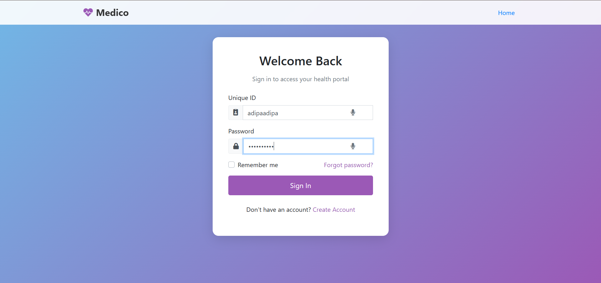
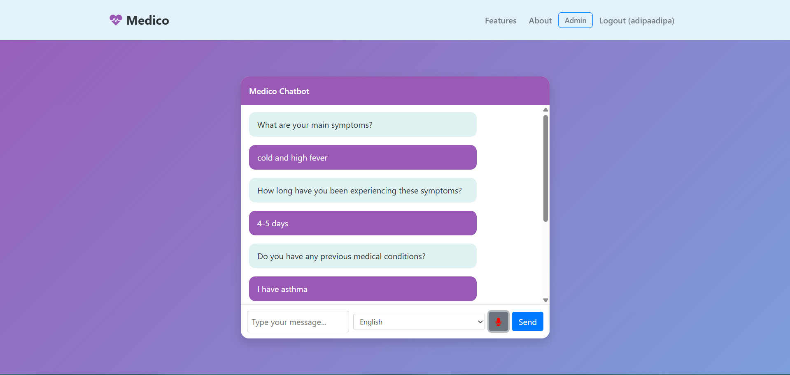
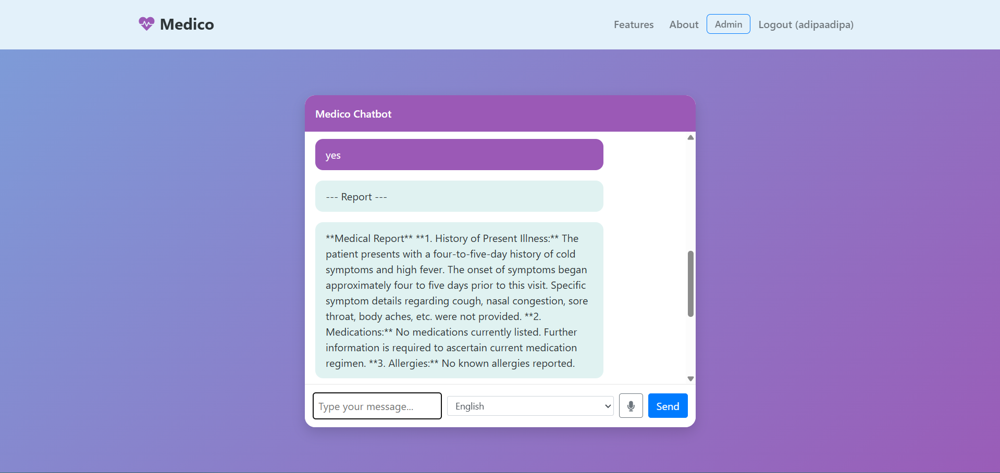

# Merilife

An AI-powered neurology assistant chatbot designed to revolutionize patient screening and healthcare communication through intelligent, multilingual, speech-enabled interactions.

## 🏥 Overview

Merilife is a comprehensive healthcare solution that serves as a virtual assistant for neurology departments. The system enables seamless patient screening, automated report generation, and multilingual communication to enhance healthcare accessibility and efficiency.

## 🎯 Key Features

- **🗣️ Speech-Based Interaction**: Natural voice conversations with patients
- **🌍 Multilingual Support**: Communication in patients' preferred languages
- **📋 Intelligent Patient Screening**: Automated preliminary health assessments
- **📊 AI-Generated Reports**: Comprehensive summaries for healthcare providers
- **🏥 Virtual Reception**: Appointment management and hospital information
- **🔐 Role-Based Access Control**: Secure access for patients, doctors, and admins
- **⚡ Real-Time Processing**: Fast response times (≤10s text, ≤15s speech)

## 🏗️ Architecture

The system follows a distributed microservices architecture with the following key components:

- **Client Interface**: User-friendly web interface for all user types
- **Load Balancer**: Traffic distribution for optimal performance
- **Authentication Server**: Secure user management with JWT/OAuth2
- **AI Processing Engine**: Intent classification and response generation
- **Medical Knowledge Base**: Validated medical information repository
- **Report Generation Module**: Automated medical report creation
- **Cache Manager**: Performance optimization through data caching
- **MongoDB Database**: Scalable data storage with encryption

## 🖼️ Application Screenshots

### User Authentication

*Secure login system with role-based access control*

### Interactive Chat Interface

*Speech-enabled chat interface with multilingual support*

### Generated Medical Reports

*AI-generated comprehensive patient screening reports*

## 🛠️ Technology Stack

### Frontend
- **ReactJS**: Modern, responsive user interface
- **Speech-to-Text API**: Voice interaction capabilities
- **Multilingual UI**: Localization support

### Backend
- **Django**: Robust web framework for authentication and core functionality
- **FastAPI**: High-performance API for real-time chatbot interactions
- **Python**: AI and machine learning logic implementation

### Database & Storage
- **MongoDB**: Scalable NoSQL database for patient records and conversations
- **Sharding & Indexing**: Optimized query performance

### Security & Performance
- **JWT/OAuth2**: Secure authentication tokens
- **HTTPS & SSL**: Encrypted communication
- **Rate Limiting**: Protection against abuse
- **Django-Axes**: Brute force attack prevention
- **Data Encryption**: GDPR-compliant patient data protection

### Deployment
- **Railway.app / Render**: Cloud hosting platforms
- **Load Balancing**: High availability and scalability

## 👥 User Roles & Capabilities

### 🏥 Patients
- Complete interactive health screenings
- Receive appointment confirmations
- Communicate in preferred language
- Access personal medical summaries

### 👨‍⚕️ Doctors
- Review AI-generated patient reports
- Customize screening questionnaires
- Provide diagnostic feedback for system improvement
- Access patient history and records

### 🔧 Administrators
- Manage user accounts and permissions
- Update FAQ databases and responses
- Monitor system performance and logs
- Configure multilingual content

## ⚡ Performance Specifications

- **Response Time**: ≤10 seconds (text), ≤15 seconds (speech)
- **Concurrent Users**: 100+ simultaneous connections
- **Screening Speed**: Complete assessment in ≤10 seconds
- **Uptime**: 99.9% availability target
- **Multi-language**: Real-time translation capabilities

## 🔒 Security Features

- **Role-Based Access Control (RBAC)**: Granular permission management
- **Data Encryption**: End-to-end patient data protection
- **Secure Authentication**: Multi-factor authentication support
- **Audit Logging**: Comprehensive activity tracking
- **HIPAA Compliance**: Healthcare data protection standards

## 🚀 Getting Started

### Prerequisites
```bash
- Python 3.8+
- Node.js 14+
- MongoDB 4.4+
- Django 4.0+
- FastAPI
```

### Installation
```bash
# Clone the repository
git clone https://github.com/your-org/merilife.git
cd merilife

# Install backend dependencies
pip install -r requirements.txt

# Install frontend dependencies
cd frontend
npm install

# Set up environment variables
cp .env.example .env
# Configure your database and API keys

# Run database migrations
python manage.py migrate

# Start the development server
python manage.py runserver
```

## 📊 System Requirements

### Functional Requirements
- ✅ Multi-language patient screening
- ✅ Automated report generation
- ✅ Appointment management
- ✅ Speech-to-text processing
- ✅ Role-based dashboard access

### Non-Functional Requirements
- ✅ Intuitive user interface
- ✅ Sub-10 second response times
- ✅ 100+ concurrent user support
- ✅ Enterprise-grade security
- ✅ 99.9% system availability

## 🤝 Contributing

We welcome contributions from the healthcare and technology community!

1. Fork the repository
2. Create a feature branch (`git checkout -b feature/AmazingFeature`)
3. Commit your changes (`git commit -m 'Add AmazingFeature'`)
4. Push to the branch (`git push origin feature/AmazingFeature`)
5. Open a Pull Request

## 👨‍💻 Development Team

- **Nikhil** - nikhil22321@iiitd.ac.in

## 🎓 Academic Sponsor

**Dr. Jainendra Shukla**  
Professor, IIIT Delhi  
jainendra@iiitd.ac.in

## 📄 License

This project is developed as part of academic research at IIIT Delhi. Please contact the development team for licensing information.


**Merilife** - Transforming healthcare communication through intelligent AI assistance 🏥✨
